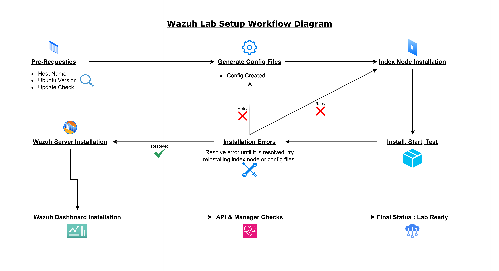

# SOC Lab – Wazuh Stack Deployment

## Overview
This repository documents the deployment and validation of a **Wazuh-based SOC home lab** on Ubuntu Linux. The goal of this project is to build a functional SIEM environment while gaining hands-on experience with installation, service validation, and troubleshooting in a production-like setup.

This project represents a **core SOC lab build**. It establishes the base platform that future SOC activities and labs will rely on.

---

## Lab Objective

- Deploy the Wazuh stack on Ubuntu
- Validate all core components are operational
- Identify and resolve real installation and service issues
- Document the process in a structured, professional manner

---

## Lab Environment

- **Operating System:** Ubuntu Server (64-bit)
- **Deployment Type:** Single-node
- **Core Components:**
  - Wazuh Manager
  - Wazuh Indexer
  - Wazuh Dashboard
- **API Port:** 55000
- **Access Method:** HTTPS (localhost)

---

## Installation Scope

This repository covers the following areas:

- System preparation and validation
- Wazuh configuration generation
- Indexer installation and cluster initialization
- Wazuh Manager installation
- Dashboard installation
- API and connector validation
- Service troubleshooting and recovery

---

## High-Level Installation Flow

1. System prerequisites verification
2. Configuration file generation
3. Indexer installation and cluster startup
4. Wazuh Manager installation
5. Dashboard deployment
6. API status validation
7. Issue resolution and service stabilization

---

## Validation Criteria

The setup is considered successful when:

- Wazuh Manager service is running
- Indexer is operational and healthy
- Dashboard is accessible via HTTPS
- Wazuh API is reachable and online
- No critical service errors are present

---

## Repository Scope & Usage

This repository is intended to:

- Serve as the foundation for future SOC labs
- Act as a reference for Wazuh deployment troubleshooting
- Demonstrate practical SIEM setup experience

It is not intended to be a production deployment guide.

---

## Architecture Diagram

This diagram illustrates the complete Wazuh stack deployment flow, including system preparation, component installation, service interactions, and validation checkpoints.

It provides a high-level visual overview of how the Wazuh Manager, Indexer, Dashboard, and API components are deployed and verified within the SOC lab environment.

**Diagram:**  

## Screenshots & Evidence

### Prerequisites

#### 1. Hostname Configuration

This screenshot shows the system hostname being changed to a professional and role-specific name (`wazuh-manager`).  
Setting a clear and consistent hostname is an important prerequisite for log identification, service clarity, and SOC environment hygiene.

**Screenshot:**  
[View Screenshot – Hostname Configuration](./screenshots/01-hostname-configuration.png)

#### 2. Ubuntu Version Verification

This screenshot captures the verification of the Ubuntu server version to ensure compatibility with Wazuh components.  
Confirming the operating system version is crucial before installation to avoid dependency or compatibility issues during deployment.

**Screenshot:**  
[View Screenshot – Ubuntu Version Verification](./screenshots/02-ubuntu-version-verification.png)

#### 3. System Update Check

This screenshot shows the system packages being checked and updated to the latest versions.  
Ensuring the system is up-to-date is essential to prevent package conflicts and to guarantee a smooth installation of Wazuh components.

**Screenshot:**  
[View Screenshot – System Update Check](./screenshots/03-system-update-check.png)

### Setup

#### 4. Wazuh Installer Download and Configuration Generation

This screenshot captures the initial installation preparation where the Wazuh installation script (`wazuh-install.sh`) and configuration file (`config.yml`) were downloaded.  
The `config.yml` file was edited using `nano` to define the node, server, and dashboard IP addresses, followed by generating the required Wazuh configuration files.

**Screenshot:**  
[View Screenshot – Installer Download & Config Generation](./screenshots/04-wazuh-installer-and-config-generation.png)

#### 5. Indexer Node Installation

This screenshot captures the installation of the Wazuh Indexer node.  
The Indexer is responsible for storing, indexing, and managing log data collected by the Wazuh Manager, making it a critical component of the SOC lab setup.

**Screenshot:**  
[View Screenshot – Indexer Node Installation](./screenshots/05-indexer-node-installation.png)

#### 6. Wazuh Indexer Cluster Startup

This screenshot shows the initialization and startup of the Wazuh Indexer cluster.  
Starting the cluster ensures that all indexer nodes are communicating correctly and ready to handle log storage and retrieval from the Wazuh Manager.

**Screenshot:**  
[View Screenshot – Indexer Cluster Startup](./screenshots/06-indexer-cluster-startup.png)

#### 7. Wazuh Indexer Cluster Testing

This screenshot captures the testing of the Wazuh Indexer cluster after startup.  
A username and password were generated for the indexer, and the cluster was tested using a `curl` command as the admin.  
The command included the server’s real IP with port `9200` and the host password generated earlier. Successful execution returned cluster details, confirming that the indexer cluster is operational.

**Screenshot:**  
[View Screenshot – Indexer Cluster Testing](./screenshots/07-indexer-cluster-testing.png)

#### 8. Wazuh Server Installation – Initial Failure & Resolution

This screenshot shows the attempt to execute the Wazuh Server installation which initially failed.  
The failure was caused by a missing GPG key and an active `apt` process from another task.  
To resolve these issues, the required GPG keys were installed, and the system was restarted to clear the `apt` lock, allowing the installation to proceed successfully.

**Screenshot:**  
[View Screenshot – Wazuh Server Installation Failure & Resolution](./screenshots/08-wazuh-server-installation-failure.png)

#### 9. Wazuh Server Installation via Bash

This screenshot captures the successful installation of the Wazuh Server using the installation bash script.  
After resolving the GPG key and `apt` issues, the bash script executed without errors, deploying the Wazuh Manager and preparing it for subsequent configuration and validation steps.

**Screenshot:**  
[View Screenshot – Wazuh Server Installation via Bash](./screenshots/09-wazuh-server-installation.png)

#### 10. Wazuh Dashboard Installation – Initial Issue

This screenshot shows the attempt to install the Wazuh Dashboard.  
During installation, the dashboard was unable to connect to `node-1` (the IP configured in `config.yml`) because the indexer was not fully functional.  
Despite the connection issue, the installation process generated a username and password for the dashboard.  
A subsequent check confirmed that the indexer was not in a functional state, indicating that further troubleshooting was required before proceeding.

**Screenshot:**  
[View Screenshot – Wazuh Dashboard Installation Initial Issue](./screenshots/10-wazuh-dashboard-installation-issue.png)

#### 11. Wazuh Indexer Restart and Status Verification

This screenshot captures the restart of the Wazuh Indexer using the `systemctl` command.  
After the restart, the indexer’s status was checked, confirming that it was fully functional and responding positively.  
This step ensured that the indexer was ready for communication with the Wazuh Dashboard and Manager.

**Screenshot:**  
[View Screenshot – Wazuh Indexer Restart & Status](./screenshots/11-wazuh-indexer-restart-status.png)

#### 12. Wazuh Dashboard Restart and Verification

This screenshot shows the Wazuh Dashboard being restarted.  
After the restart, the dashboard became fully functional and operational, confirming successful communication with the Wazuh Manager and Indexer, and making it accessible via HTTPS.

**Screenshot:**  
[View Screenshot – Wazuh Dashboard Restart & Verification](./screenshots/12-wazuh-dashboard-restart-verification.png)

#### 13. Wazuh Dashboard Login – API Offline

This screenshot captures logging into the Wazuh Dashboard using the provided credentials.  
Upon login, the dashboard displayed that the API status was offline, indicating that API connections were down or inaccessible.  
This step highlighted the need for further troubleshooting to bring the Wazuh API online.

**Screenshot:**  
[View Screenshot – Dashboard Login & API Offline](./screenshots/13-dashboard-login-api-offline.png)

#### 14. Wazuh Manager Service Status Check

This screenshot shows the verification of the Wazuh Manager service.  
The service was confirmed to be running and in a healthy state, ensuring that the core Wazuh components were operational before addressing the API connectivity issue.

**Screenshot:**  
[View Screenshot – Wazuh Manager Service Status](./screenshots/14-wazuh-manager-status.png)

#### 15. Wazuh Manager Listening Ports Check

This screenshot shows the listening status of the Wazuh Manager.  
Two listening entries were observed, each with a backlog of `2048` connections.  
The first entry was bound to `0.0.0.0` (all IPv4 addresses), and the second entry to `[::]` (all IPv6 addresses), confirming that the manager was correctly listening on the expected network interfaces.

**Screenshot:**  
[View Screenshot – Wazuh Manager Listening Ports](./screenshots/15-wazuh-manager-listening.png)

#### 16. Wazuh Indexer Connector Initialization Failures

This screenshot captures the repeated warnings from Wazuh modules indicating that the Indexer Connector failed to initialize for various mini managers, including system processes, ports, hotfixes, hardware, and other components.  
These errors highlighted that the Wazuh Manager was unable to communicate with the Indexer for collecting and storing inventory and vulnerability data, necessitating further troubleshooting.

**Screenshot:**  
[View Screenshot – Indexer Connector Initialization Failures](./screenshots/16-indexer-connector-failures.png)

#### 17. Wazuh Manager Reinstallation and Start

This screenshot shows the deletion of the previous Wazuh Manager installation, followed by reinstalling and starting the service.  
Reinstallation resolved previous issues with module connectivity and API accessibility, ensuring a fresh and fully functional Wazuh Manager setup.

**Screenshot:**  
[View Screenshot – Wazuh Manager Reinstallation & Start](./screenshots/17-wazuh-manager-reinstallation.png)

#### 18. Wazuh Dashboard API Online

This screenshot shows the Wazuh Dashboard after refreshing the webpage following the Wazuh Manager reinstallation.  
The API status was now online and fully operational, indicating that all components were correctly communicating and ready for use in the SOC lab environment.

**Screenshot:**  
[View Screenshot – Dashboard API Online](./screenshots/18-dashboard-api-online.png)

